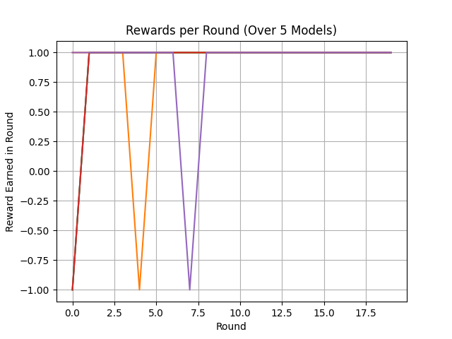

# Simplest Reinforcement Learning Example

I am learning Reinforcement Learning and wanted to create the simplest possible example so that I can begin to understand the concepts and how to use them in practice.

## Overview

This is an extremely simple reinforcement learning exercise, done for learning purposes.

The Environment is a simple game. Every 'round' the environment will present a state (0, 1). It is up to the RL model to echo the environment with its actions, being either (0, 1).

This is totally impractical - you could simply write a controller to have an if loop and in 2 lines you could have 100% success. That's not the point of this

### Notes:
- This includes no future-potential of reward consideration
- This does not perform any exploration

## Architecture
The RL architecture for this is to use a simple Q-Learning Table.

| State | Action 0 | Action 1 |
|-------|----------|----------|
|   0   |    a     |    b     |
|   1   |    c     |    d     |

Where a, b, c, and d are the learned parameter values.

### Q Update Function

Normal Q Learning Function (factoring in future rewards):

> Q(s, a) = Q(state, action) + alpha(reward + y(max(Q(next_state, :)) - Q(s, a))

Simplified Equation as future potential means nothing in this example:

>Q(s, a) = Q(s, a) + alpha(reward - Q(s, a))

## Performance
Since this is so simple, the model learns almost immediately:

